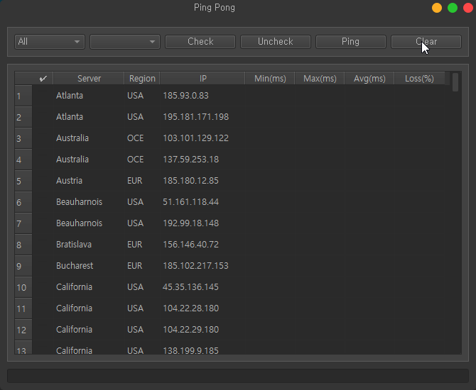
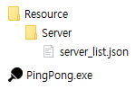
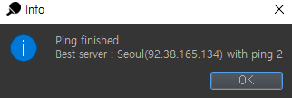

# python-ping-tester


[](https://www.codefactor.io/repository/github/pepsizerosugar/python-ping-tester)


* Ping test utility GUI
* Make with
    * Python [3.9.10](https://www.python.org/downloads/release/python-3910/)
    * [PyQt5](https://github.com/PyQt5) GUI library
    * [qtmodern](https://github.com/gmarull/qtmodern) theme

<br>

<br><br>

## 0. Change Log

### version 1.5.6 (2023.02.28)

* Commit history
  * [pepsi-096] FEAT: update server list ([@Avnsx](https://github.com/Avnsx))
  * [pepsi-097] FEAT: modify column width to match server name length
  * [pepsi-099] DOCS: update README.md
* Upcoming feature (#To-do)
  * Add Ping Results Analysis tab.
  * Modify to set ping options.

<br>

## 1. Getting Started

### 1-1. Installation

1. Download the latest version from [GitHub](https://github.com/pepsizerosugar/python-ping-tester/releases) or Clone
   the repository.
    1. ```git clone https://github.com/pepsizerosugar/python-ping-tester.git```

2. Build Main.py using build.bat or just run.
    1. When build is finish, you can run the PingPong.exe in the dist folder.
    2. server_list.json file at Resource\Server folder is automatically copy to dist\Resource\Server folder.
       <br>
       
3. Or downaload the latest binary file what name "PingPong.zip"
   from [GitHub](https://github.com/pepsizerosugar/python-ping-tester/releases) and unzip it.

### 1-2. How to use

* Edit server list
    1. Open the server_list.json file at Resource\Server.
    2. Enter the list of servers you want to ping according to the server list format.
    3. Save the file.

* Server list json format

```json
{
  "server_list": {
    "ServerName01": {
      "region": "USA",
      "ip_addresses": [
        "111.222.333.444",
        "111.222.333.444"
      ]
    },
    "ServerName02": {
      "region": "OCE",
      "ip_addresses": [
        "111.222.333.444",
        "111.222.333.444"
      ]
    }
  }
}
```

* Interactions
    1. Type combo box
        1. ```All``` is default.
        2. If select ```Server```, you can select the server name from the list at Select combo box.
        3. If select ```Region```, you can select the region name from the list at Select combo box.
    2. Select combo box
        1. If select ```Server``` at type combo box, you can select the server from the list.
        2. If select ```Region``` at type combo box, you can select the region from the list.
    3. Check button
        * Check servers what you selected at Select combo box.
    4. Uncheck button
        * Uncheck all servers in the list.
    5. Ping button
        * Ping checked servers in the list.
    6. Clear button
        * Clear ping result in the list.

* When you click the Ping button, the ping result will be shown in the list.
* The ping result will automatically sort by avg ping time.
* And the best ping time result will be shown in the messagebox when all ping finished.
    * 

## 2. Extra

### 2-1. Analyze

* Analyze of ping result is shown in log.
    * Log file is generated at Logs\ping_test_${datetime}.log
    * One for server, one for region.

### 2-2. Reference

* PyQt5 Tutorial Doc (Korean): https://wikidocs.net/book/2165
* Qt API Doc (English): https://doc.qt.io/
* Qt 5 for Python Doc (English): https://doc.qt.io/qtforpython-5/
* PyQt5 Official Doc (English): https://www.riverbankcomputing.com/static/Docs/PyQt5/
* PyInstaller Doc (English): https://pyinstaller.readthedocs.io/en/stable/usage.html
* Python Official Doc (English): https://docs.python.org/3.9/
