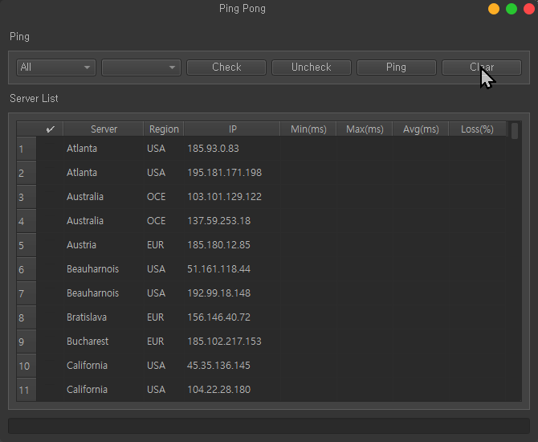
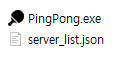
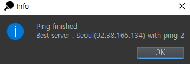

# python-ping-tester


[](https://www.codefactor.io/repository/github/pepsizerosugar/python-ping-tester)

* Ping test utility GUI
* Make with 'PyQt5' GUI library
  <br><br>
  
  <br><br>

## 0. Change Log

### version 1.3.0 (2022.02.**)

* Commit history
    * [pepsi-040] changed ping result parsing flow to avoid errors from QTableWidget sorting API
    * [pepsi-039] changed group box name
    * [pepsi-038] created combobox for select specific options
    * [pepsi-037] changed analyze order
    * [pepsi-036] changed build script to add resource
    * [pepsi-035] changed icon path

<br>

## 1. Getting Started

### 1-1. Installation

1. Download the lastest version from [GitHub](https://github.com/pepsizerosugar/python-ping-tester/releases) or Clone the
   repository.
    1. ```git clone https://github.com/pepsizerosugar/python-ping-tester.git```

2. Build Main.py using build.bat or just run.
    1. When build is done, you can run the PingPong.exe in the dist folder.
    2. server_list.json file at top-level folder is automatically copy to dist folder.
       <br>
       
3. Or downaload the lastest binary file what name "PingPong.zip" from [GitHub](https://github.com/pepsizerosugar/python-ping-tester/releases) and unzip it.

### 1-2. How to use

* Edit server list
    1. Open the server_list.json file.
    2. Enter the list of servers you want to ping according to the server list format.
    3. Save the file.

* Server list json format

```json
{
  "server_list": {
    "ServerName01": {
      "region": "USA",
      "ip_addresses": [
        "111.222.333.444",
        "111.222.333.444"
      ]
    },
    "ServerName02": {
      "region": "OCE",
      "ip_addresses": [
        "111.222.333.444",
        "111.222.333.444"
      ]
    },
  }
}
```

* Buttons
    1. Check All button
        * Check all servers in the list.
    2. Uncheck All button
        * Uncheck all servers in the list.
    3. Ping button
        * Ping checked servers in the list.
    4. Clear button
        * Clear ping result in the list.

* When you click the Ping button, the ping result will be shown in the list.
* And the best ping time result will be shown in the messagebox when all ping finished.
    * 
* After click the ok at messagebox, the ping result will automatically sort by ping time.
